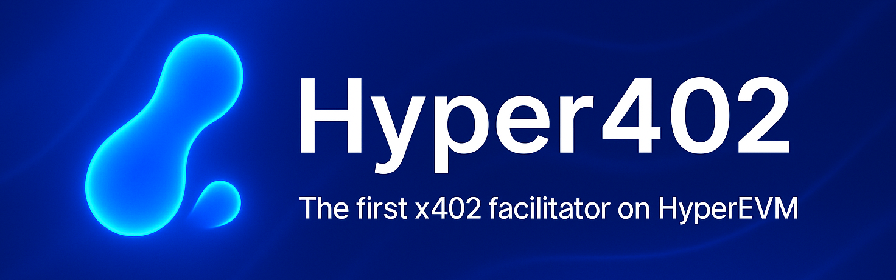

# Hyper402 - x402 Facilitator for HyperEVM (and friends)



**Hyper402 is the first x402 payment facilitator for HyperEVM**, enabling API services and content providers to monetize their offerings and receive onchain payments on HyperEVM.  
The facilitator, demo API, and Next.js client now share a single `CHAIN_CONFIGS` runtime so you can point the entire stack at *any* EIP-3009-compatible EVM chain (Base Sepolia, Base mainnet, Polygon Amoy, custom rollups, etc.) without touching the code. Polygon Amoy is the out-of-the-box default.

**built for the HyperEVM Hackathon hosted by Looping Collective & StakingRewards at Devconnect Buenos Aires, November 2025**

## what is Hyper402?

Hyper402 is a self-hosted x402 facilitator that brings the x402 payment protocol to HyperEVM, starting on testnet but easily configurable for mainnet

it enables API providers to accept USDC payments on HyperEVM using the same dead-simple integration other facilitators provide on chains like Solana and Base

### features

- **EIP-3009 compatible** - gasless payments using `transferWithAuthorization`  
- **CDP Server Wallets** - secure key management and automatic nonce & retry handling 
- **standard x402 protocol** - works with existing x402 client libraries  
- **production-ready** - full verification and settlement logic  
- **open source** - template for adding x402 to any EVM chain  
- **multi-chain ready** - set `CHAIN_CONFIGS` once and the facilitator, demo API, and client all expose your networks (users pick their preferred chain at runtime)

### configurable chains (`CHAIN_CONFIGS`)

Define one or more chains via an environment variable shared across:

- `packages/hyper402-facilitator` (verification + settlement)  
- `demo/server` (x402 middleware + balance endpoint)  
- `demo/client` (Next.js UI that lets users choose a chain and faucet tokens)

```json
[
  {
    "network": "base-sepolia",
    "chainId": 84532,
    "name": "Base Sepolia",
    "rpcUrl": "https://sepolia.base.org",
    "blockExplorer": "https://sepolia.basescan.org",
    "faucetUrl": "https://faucet.circle.com",
    "nativeCurrency": { "name": "ETH", "symbol": "ETH", "decimals": 18 },
    "token": {
      "address": "0xYourUSDCAddress",
      "name": "USDC",
      "symbol": "USDC",
      "decimals": 6,
      "version": "2"
    }
  }
]
```

Expose this JSON as `CHAIN_CONFIGS` (or rely on the built-in Polygon Amoy → HyperEVM fallback chain list). The demo client fetches `/chains` from the API to display the list, so end users can pick any configured network without redeploying.

## high-level architecture

my core contributions here  are:
- x402 Facilitator for HyperEVM
- custom payment middleware implementation that works on any EVM chain (API providers use this part and it calls the facilitator)
- custom x402-fetch equivalent on the client side

**along with these, I've included an end-to-end, full-stack demo showcasing HyperEVM x402 payments in action**:

- web app lets the user sign in, get a CDP Embedded Wallet, and faucet USDC on HyperEVM testnet
- the user can one-click call a simple x402-enabled API running in the backend, which uses Hyper402's facilitator on HyperEVM
- the API will respond with 402 payment required, directing the user to pay $0.01 USDC on HyperEVM testnet to access its services
- the client wallet signs and retries using the X-PAYMENT header the x402 protocol expects
- the API server calls Hyper402's facilitator to verify and settle payment on HyperEVM
- with payment complete, the API provides the requested service/content to the user


```
┌──────────────┐         ┌──────────────┐         ┌──────────────┐
│    client    │         │   demo API   │         │   Hyper402   │
│              │◄───────►│              │◄───────►│ (facilitator)│
└──────────────┘         └──────────────┘         └──────────────┘
                                                          │
                                                          ▼
                                                   ┌──────────────┐
                                                   │ CDP Server   │
                                                   │   Wallet     │
                                                   └──────┬───────┘
                                                          │
                                                          ▼
                                                   ┌──────────────┐
                                                   │  HyperEVM    │
                                                   │   testnet    │
                                                   └──────────────┘
```

## project structure

```
hyper402/
├── packages/
│   └── hyper402-facilitator/    # facilitator implementation
│       ├── src/
│       │   ├── server.ts        # express server with /verify & /settle
│       │   ├── verify.ts        # payment verification logic
│       │   ├── settle.ts        # settlement via CDP Server Wallets
│       │   ├── config.ts        # HyperEVM & USDC configuration
│       │   ├── types.ts         # TypeScript interfaces
│       │   └── index.ts         # exports facilitator instance
│       └── package.json
└── demo/
    ├── server/                   # demo API using Hyper402
    │   ├── index.js             # express API with x402 middleware
    │   └── package.json
    └── client/                   # web app
        ├── app/                 # next.js app with CDP Embedded Wallet
        └── package.json
```

## quickstart

### pre-reqs

1. Node.js v18+
2. CDP API Key from https://portal.cdp.coinbase.com/
3. CDP Server Wallet with HYPE on HyperEVM testnet to pay gas fees (I used gas.zip and Quicknode Faucet)

### 1. install dependencies

```bash
npm install
```

### 2. configure Hyper402 facilitator

```bash
cd packages/hyper402-facilitator
cp .env.example .env
```

Edit `.env`:
```env
CDP_API_KEY_ID=your-api-key-id
CDP_API_KEY_SECRET=your-api-key-secret
PORT=3002
```

### 3. build the facilitator

```bash
cd packages/hyper402-facilitator
npm run build
cd ../..
```

### 4. start Hyper402 facilitator

```bash
npm run dev:facilitator
```

you should see:
```
✅ Facilitator wallet initialized: 0x...
⚠️ Make sure this wallet has HYPE for gas!
🚀 Hyper402 Facilitator running on http://localhost:3002
```

**important:** fund the facilitator wallet with testnet HYPE for gas!

### 5. configure demo API

```bash
cd demo/server
cp .env.example .env
```

Edit `.env`:
```env
RECEIVER_WALLET=0xYourWalletAddressHere
HYPER402_FACILITATOR_URL=http://localhost:3002
```

### 6. start demo API server

```bash
npm run dev:server
```

### 7. configure client

```bash
cd demo/client
cp .env.local.example .env.local
```

Edit `.env.local`:
```env
NEXT_PUBLIC_CDP_PROJECT_ID=your-project-id
NEXT_PUBLIC_API_URL=http://localhost:3003
```

### 8. start client

```bash
npm run dev:client
```

visit http://localhost:3004 - you can sign in and experience the end-to-end flow using Hyper402

## how it works

### for API providers

as the hackathon project P0, integration requires custom middleware (~20 lines) since the standard x402 middleware package doesn't support custom chains yet - see `demo/server/index.js` for the full implementation

**future state** (after publishing Hyper402 custom middleware; see roadmap below):

```javascript
import { paymentMiddleware } from "@hyper402/x402-express";
import { facilitator } from "@hyper402/facilitator";

app.use(paymentMiddleware(
  "0xYourWallet",
  {
    "GET /api": {
      price: "$0.01",
      network: "hyperevm-testnet"
    }
  },
  facilitator
));
```

### for users & agents

1. sign in (supports various web2-friendly auth methods), get a CDP Embedded Wallet under the hood
2. get HyperEVM testnet USDC from Circle's faucet
3. call paid APIs, paying via x402

## tech details

### HyperEVM testnet configuration

- **chain id:** 998
- **RPC:** https://rpc.hyperliquid-testnet.xyz/evm
- **native token:** HYPE (for gas)
- **USDC contract:** `0x2B3370eE501B4a559b57D449569354196457D8Ab`
- **explorer:** https://testnet.purrsec.com/

### payment flow

1. client requests API endpoint
2. server returns 402 with payment requirements
3. client creates EIP-3009 authorization (signed off-chain)
4. client retries with X-PAYMENT header
5. server calls Hyper402 `/verify`
6. Hyper402 verifies signature & checks balance
7. server calls Hyper402 `/settle`
8. Hyper402 calls `transferWithAuthorization` via CDP Server Wallet
9. CDP Server Wallet pays gas (HYPE)
10. USDC transfers from client to API provider
11. server returns protected content

### why Hyper402 matters

**for the x402 ecosystem:**
- first facilitator beyond Base & Solana
- proves x402 works on any EVM chain
- reference implementation for other chains

**for HyperEVM:**
- enables API monetization on HyperEVM
- showcases EVM compatibility
- drives HYPE usage
- attracts developers building paid services

**for CDP:**
- demonstrates Server Wallets on HyperEVM
- shows Embedded Wallet flexibility

## deployment

here's the info you'd need to deploy this (e.g. to vercel):

### facilitator

environment variables:
- `CDP_API_KEY_ID`
- `CDP_API_KEY_SECRET`
- `HYPEREVM_RPC_URL`

### demo API

environment variables:
- `RECEIVER_WALLET`
- `HYPER402_FACILITATOR_URL`

### client

environment variables:
- `NEXT_PUBLIC_CDP_PROJECT_ID`
- `NEXT_PUBLIC_API_URL`

don't forget to allowlist your domain in CDP Portal under Embedded Wallets! The web app demo won't work without that

## roadmap

I mostly built Hyper402 on the long flight from Seattle to Buenos Aires, so the scope is limited. There are a ton of future directions I might take this, or that you can feel free to explore! Some ideas below -

### immediate next steps

1. **`@hyper402/client` payment library** - extract the custom client implementation (`demo/client/app/hyper402-client.ts`) into a reusable npm package:
   - TypeScript API for x402 payments on custom chains
   - would work with any EVM chain (not just HyperEVM)
   - developers can use it instead of x402-fetch until x402 v2 spec comes out
   - pair with any x402 facilitator

2. **`@hyper402/express` server middleware** - extract the custom server middleware into a package:
   - works like x402-express but supports custom EVM chains
   - API providers get back to the simple 3-line integration
   - combined with hosted Hyper402 facilitator, this makes it dead-simple

### production deployment

3. **production HyperEVM facilitator** - deploy Hyper402 as a production-grade facilitator on HyperEVM mainnet with:
   - fleet of CDP Server Wallets for high throughput and redundancy while minimizing error rate
   - intelligent load balancing across multiple facilitator instances
   - monitoring, alerting, and analytics dashboard
   - rate limiting and abuse prevention
   - uptime SLA guarantees

4. **monetization features** - turn Hyper402 into a sustainable business:
   - optional facilitator fees (e.g., 0.1% of transaction value, or flat rate per settled txn)
   - premium tier with higher throughput guarantees
   - analytics and insights for API providers
   - webhook notifications for payment events

### advanced features

5. **multi-token support** - accept and disburse in any token:
   - native token swaps via HyperEVM DEXes
   - users pay in any HyperEVM-supported token they have (USDC, HYPE, wBTC, etc)
   - API providers receive in their preferred token
   - automatic conversion handled by facilitator; neither party has to think about the swap in between
   - route optimization for best swap rates

6. **Looping Collective integration** 🔄 - yield on API revenue:
   - enable API providers to auto-deposit a % of earnings into a liquid looping strategy like LHYPE
   - earn yield on revenue while maintaining liquidity
   - configurable allocation (e.g. 50% liquid, 50% looped or whatever)
   - dashboard showing revenue + accumulated yield
   - one-click withdrawal from looping positions

7. **HyperCore support** - extend Hyper402 beyond HyperEVM:
   - implement x402 facilitator for HyperCore (Hyperliquid L1)
   - enable cross-chain payments (pay on HyperCore, settle on HyperEVM)
   - unified facilitator handling both chains with configurability
   - would demonstrate x402's multi-chain flexibility and drive more Hyperliquid usage

### ecosystem expansion

8. **discovery layer** - HyperEVM API marketplace:
   - catalog of x402-enabled APIs on HyperEVM
   - searchable by category, price, rating
   - one-click integration for developers
   - revenue leaderboard for top APIs

### community & governance

9. **open governance** - decentralize Hyper402:
    - DAO for facilitator parameters (fees, supported tokens)
    - community-run facilitator nodes
    - revenue sharing with node operators
    - grants for ecosystem development

the core contribution here — a working x402 facilitator for HyperEVM — is a foundation that can grow into critical infrastructure for a rich API economy settling on Hyperliquid & HyperEVM 🔥

## learnings & key insights

### x402 hardcoded network limitations (client & server)

**insight:** the entire x402 stack has hardcoded network enums:
- **server side:** `x402-express` middleware rejects custom networks
- **client side:** `x402-fetch` also validates networks via zod schema
- both only allow: Base, Base Sepolia, Solana, Solana Devnet, afaict
- custom EVM chains like HyperEVM testnet are rejected at BOTH ends

**solution:** I implemented x402 protocol from scratch for both client and server (~180 lines total):

**server** (`demo/server/index.js` ~50 lines):
- custom middleware that detects protected endpoints
- returns 402 with proper payment requirements
- calls Hyper402 facilitator's /verify and /settle
- adds X-PAYMENT-RESPONSE header

**client** (`demo/client/app/hyper402-client.ts` ~130 lines):
- detects 402 responses
- creates EIP-3009 transferWithAuthorization payload
- signs EIP-712 with correct chainID 998
- constructs X-PAYMENT header
- retries request with payment

**why custom implementation won:**
- full control over chainID & network handling
- no fighting with hardcoded library validation
- demonstrates deep x402 protocol understanding
- clean, readable code for judges to review
- proved to be simpler than workarounds

**key lesson:** Sometimes it's faster to implement a clean spec yourself than to fight well-intentioned libraries designed for different constraints. The x402 *protocol* is elegant and chain-agnostic; the *libraries* currently assume/require use of specific networks

### EIP-712 domain parameter differences across chains

**challenge:** USDC contracts on different chains use different EIP-712 domain names, causing signature validation failures

**finding:** HyperEVM's USDC contract uses:
- `name: "USDC"` 
- `version: "2"`

while other chains (like Base) use:
- `name: "USD Coin"`
- `version: "2"`

**impact:** initial signatures failed with "invalid signature" errors because I assumed all USDC deployments used "USD Coin" - the EIP-712 signature must match the exact contract's domain parameters

**solution:** query the contract directly to get actual values:
```javascript
const name = await usdcContract.read.name();    // "USDC" on HyperEVM
const version = await usdcContract.read.version(); // "2"
```

**lesson:** never assume EIP-712 domain parameters; always verify from the contract, especially when bridging to different chains. small differences break signatures

### testnet faucet challenges

**challenge:** getting testnet HYPE was surprisingly difficult during the hackathon; most faucets had strict requirements:
- Quicknode faucet: Requires 0.05 HYPE on Hyperliquid mainnet
- Chainstack faucet: Requires 0.08 ETH on Ethereum mainnet + some mainnet activity history
- these anti-abuse measures are understandable but create barriers for legitimate hackathon projects

**solution:** used gas.zip and eventually Quicknode faucet

**insight:** hackathons and testnets need dedicated builder faucets with different access patterns (e.g. Discord verification, GitHub account age, etc) rather than mainnet balance requirements

## license

MIT

## links

- [x402 protocol](https://www.x402.org/)